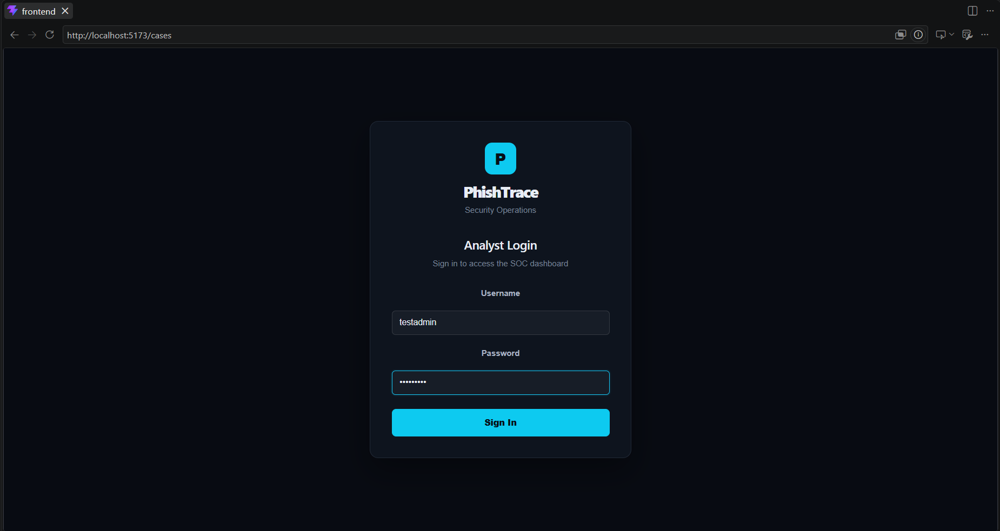
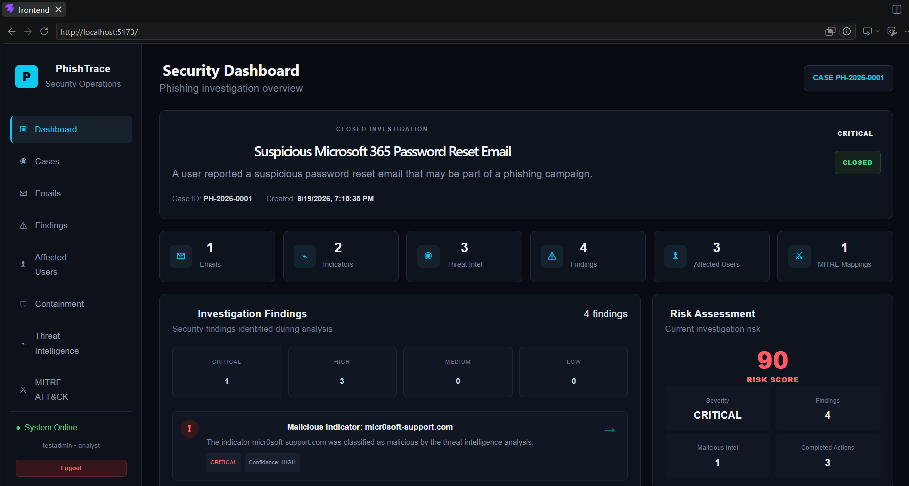
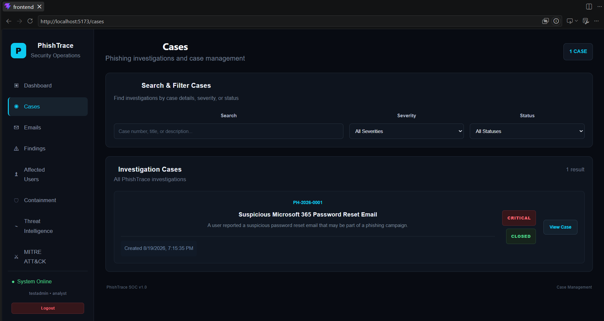
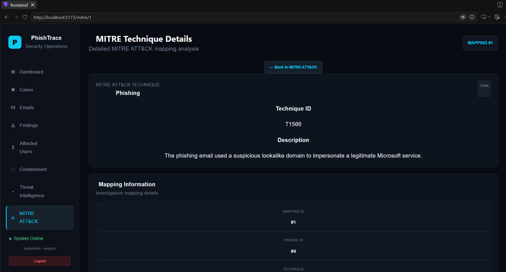
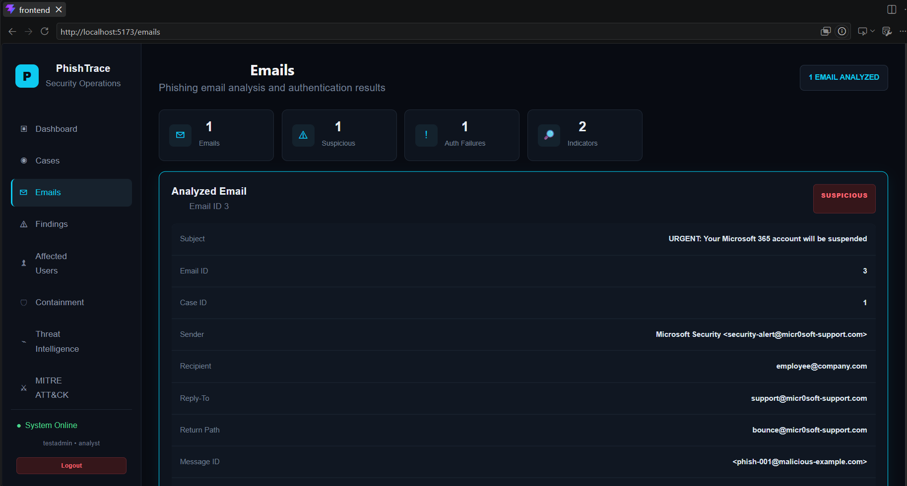
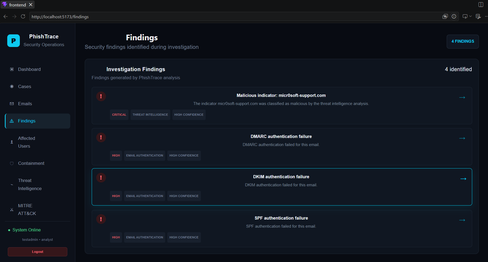
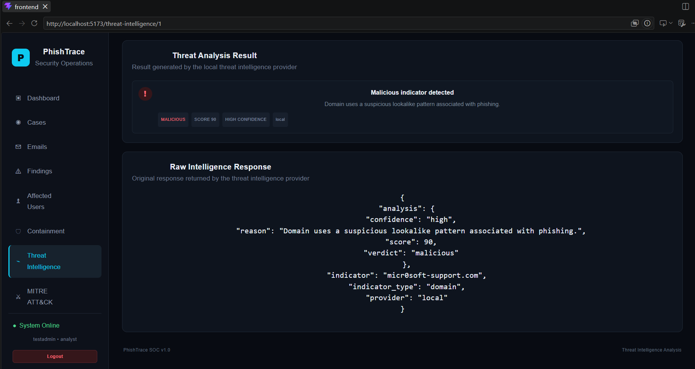
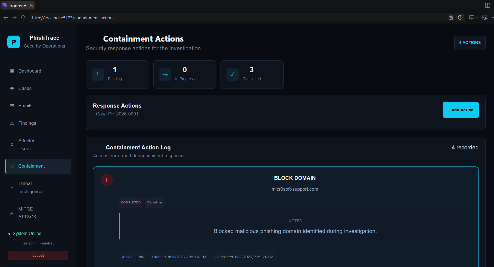
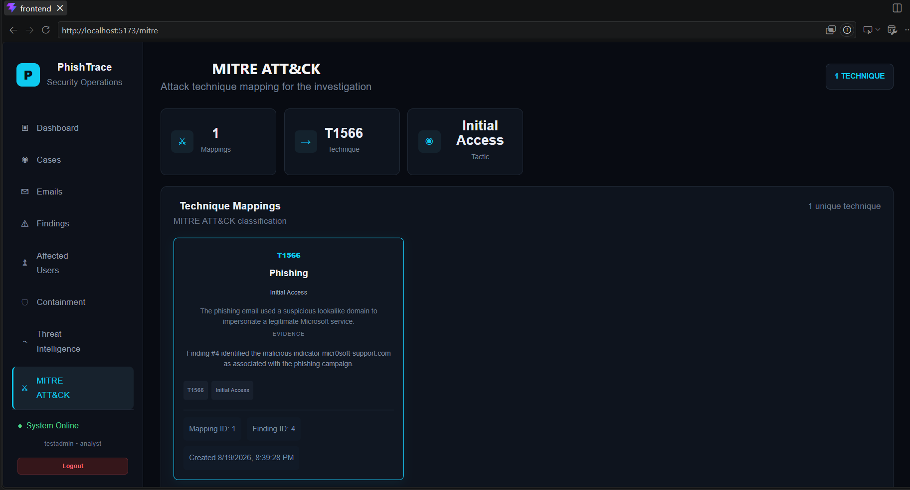

# PhishTrace

PhishTrace is a phishing email investigation and incident response platform designed to simulate a real-world Security Operations Center (SOC) investigation workflow.

The platform provides a structured workflow for investigating suspicious emails, analysing authentication results, extracting indicators of compromise, performing threat intelligence analysis, generating security findings, assessing risk, investigating affected users, performing containment actions, and mapping findings to MITRE ATT&CK techniques.

---

## Project Goal

The goal of PhishTrace is to simulate how a SOC analyst can investigate and respond to a phishing incident from initial email triage through investigation, risk assessment, containment, and incident analysis.

The platform brings multiple investigation stages together into a single interface so that evidence can be correlated throughout the incident lifecycle.

---

## Investigation Workflow

The PhishTrace investigation workflow follows these stages:

1. Triage the reported phishing email
2. Analyse email headers and authentication
3. Extract URLs, domains, IP addresses and file hashes
4. Analyse extracted indicators using threat intelligence
5. Generate security findings
6. Assess the overall case risk
7. Identify affected users
8. Perform and track containment actions
9. Map findings to MITRE ATT&CK
10. Review the complete case investigation summary

---

## Key Features

### 🔐 Authentication

- Analyst login system
- User registration
- Password hashing
- Session-based authentication
- Protected API endpoints
- Active/inactive user validation
- Logout functionality
- Authentication persistence across page refreshes

### 📁 Case Management

- Create investigation cases
- View all investigation cases
- View individual case details
- Update case information
- Track case severity
- Track investigation status
- Close completed cases

### 📧 Email Investigation

- Associate emails with investigation cases
- Store sender and recipient information
- Store subject and email metadata
- Store return-path and reply-to information
- Store raw email content
- View individual email investigations

### 🛡️ Email Authentication Analysis

The platform supports analysis of:

- SPF
- DKIM
- DMARC
- DMARC alignment
- Sender domains
- Return-path domains
- DKIM domains
- Authentication verdicts
- Analyst analysis notes

Authentication failures can be converted into security findings.

### 🔎 Indicator Extraction

PhishTrace automatically extracts indicators from email content, including:

- URLs
- IP addresses
- Domains
- MD5 hashes
- SHA-1 hashes
- SHA-256 hashes

Extracted indicators are stored and associated with the original email.

### 🌐 Threat Intelligence

PhishTrace includes a local threat-intelligence analysis engine that evaluates indicators and produces:

- Verdict
- Risk score
- Confidence level
- Analysis reason
- Provider information
- Investigation notes

The current implementation uses a local provider and is structured so that external threat-intelligence providers can be integrated in future versions.

### 🚨 Security Findings

Findings can be generated from investigation evidence such as:

- SPF failures
- DKIM failures
- DMARC failures
- Malicious indicators

Each finding can contain:

- Finding type
- Title
- Description
- Severity
- Confidence
- Evidence
- Analyst notes
- Case association

### 👥 Affected Users

The platform allows analysts to track users affected by a phishing campaign.

Tracked information includes:

- User email
- Display name
- Department
- Whether the email was received
- Whether a link was clicked
- Whether credentials were submitted
- Whether the account was compromised
- Impact status
- Investigation notes

### 🛡️ Containment Actions

Analysts can create and track response actions such as:

- Disable User Account
- Block Malicious Domain
- Block Sender
- Quarantine Email
- Reset Password
- Isolate Endpoint
- Remove Email
- Other response actions

Each action can have a status:

- Pending
- In Progress
- Completed
- Failed

Containment actions can also record the target, analyst, notes and completion time.

### ⚠️ Risk Assessment

PhishTrace calculates a case risk score based on finding severity.

Severity weighting:

| Severity | Score |
|----------|------:|
| Critical | 40 |
| High | 25 |
| Medium | 15 |
| Low | 5 |

The total score is capped at 100.

Risk levels are classified as:

| Score | Risk Level |
|------:|------------|
| 0–29 | Low |
| 30–59 | Medium |
| 60–79 | High |
| 80–100 | Critical |

### 🎯 MITRE ATT&CK

Security findings can be mapped to MITRE ATT&CK techniques.

MITRE mappings can include:

- Technique ID
- Technique name
- Tactic
- Description
- Evidence
- Associated finding

This allows analysts to connect investigation findings with adversary behaviour and attack techniques.

### 📊 Case Summary

The case summary brings the investigation together and provides information about:

- Case details
- Emails
- Indicators
- Threat intelligence results
- Findings
- Affected users
- Containment actions
- MITRE ATT&CK mappings

---

## Technology Stack

### Frontend

- React
- Vite
- JavaScript
- CSS
- React Router

### Backend

- Python
- Flask
- SQLAlchemy
- Flask session-based authentication

### Database

- Relational database using SQLAlchemy ORM

### Security

- Werkzeug password hashing
- Session-based authentication
- Protected API endpoints
- Input validation
- Authentication and authorization checks

### Development Tools

- Git
- GitHub
- Visual Studio Code

---

## Screenshots

### Analyst Login



### SOC Dashboard



### Case Management



### Case Summary



### Email Investigation



### Security Findings



### Threat Intelligence



### Containment Actions



### MITRE ATT&CK



---

## System Architecture

```text
                    ┌─────────────────────┐
                    │      Analyst        │
                    └──────────┬──────────┘
                               │
                               ▼
                    ┌─────────────────────┐
                    │   React Frontend    │
                    │      + Vite         │
                    └──────────┬──────────┘
                               │
                         HTTP / API
                               │
                               ▼
                    ┌─────────────────────┐
                    │    Flask Backend    │
                    │                     │
                    │ Authentication      │
                    │ Case Management     │
                    │ Email Analysis     │
                    │ Findings            │
                    │ Threat Intelligence │
                    │ Risk Assessment     │
                    │ Containment         │
                    │ MITRE ATT&CK        │
                    └──────────┬──────────┘
                               │
                               ▼
                    ┌─────────────────────┐
                    │     Database        │
                    │   SQLAlchemy ORM    │
                    └─────────────────────┘